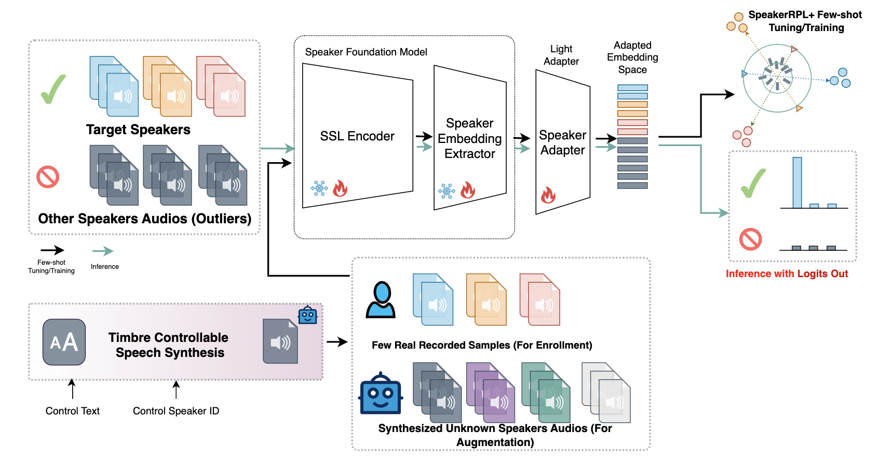

# Efficient Open-Set Speaker Identification through Few-shot Tuning with Speaker Reciprocal Points and Unknown Samples

## Overview

This paper introduces a novel framework for few-shot open-set speaker identification, aimed at real-world house-hold wake-up scenarios. To address the limitations of current
speaker models and classification methods, our approach combines a pretrained speaker foundation frontend with a few-shot tunable neural network backend. We employ an effective open-set recognition technique called Speaker Reciprocal Points Learning (SpeakerRPL) to enhance discrimination among target speakers while modeling “otherness.” Moreover, we propose SpeakerRPL+, which integrates unknown sample learning via speech-synthesized unknown data, significantly boosting few-shot open-set SID performance. We also investigate optimal model-tuning strategies, zero-shot timbre-controllable synthesis methods, and training procedures for SpeakerRPL+, demonstrating its adaptability across various speaker foundation models. Comprehensive evaluations on multiple multi-language, text-dependent speaker recognition datasets confirm the efficacy of our framework in complex household environments, yielding superior few-shot open-set speaker identification performance over several state-of-the-art speaker foundation models.

<p align="center">
  
</p>

## Dataset

We utilize 6 primary datasets in our research, which are shared on the Hugging Face repository.

- **[Training and testing split](https://huggingface.co/datasets/zhiyongchen/speakerRPL_dataset/tree/main)** 


## Speech Foundation Models

Our method is built upon two pretrained audio foundation models:

- [**EResNetV2**](https://github.com/modelscope/3D-Speaker)
- [**WavLM-base-plus**](https://huggingface.co/microsoft/wavlm-base-plus-sv)

## Evaluations

The evaluation section details the performance metrics on open-set speaker identification. The **Open Set Classification Rate (OSCR)** calculates the area under the curve mapping the Correct Classification Rate (CCR) for known classes to the False Positive Rate (FPR) for unknown data, offering a threshold-independent evaluation for open-set.


You can access the core evaluation metrics and inference script for evaluation in our code repository.

- **[Inference script and evaluation metrics implementation](https://github.com/zhiyongchenGREAT/speaker-reciprocal-points-learning)**

Run the script as follows:
```bash
python osr_spk_cn_{dataset}.py
```
or with unknown synthetic enhancement samples
```bash
python osr_spk_cn_{dataset}.py --cs_my
```

## Code
The code used in this research for model training and evaluation is available in the repository:
- **[Inference script and evaluation metrics implementation](https://github.com/zhiyongchenGREAT/speaker-reciprocal-points-learning)**
  
We also provided the fine-tuned models.
- **[ckpt](https://huggingface.co/datasets/zhiyongchen/speakerRPL_dataset/tree/main)**

Direct inference for experiment with:
```bash
eval_for_cosine_eres2net.ipynb
```
## Citation

If this work contributes to your research, please consider citing our paper:

```bibtex
@inproceedings{chen2024enhancing,
  title={Enhancing Open-Set Speaker Identification Through Rapid Tuning With Speaker Reciprocal Points and Negative Sample},
  author={Chen, Zhiyong and Ai, Zhiqi and Li, Xinnuo and Xu, Shugong},
  booktitle={2024 IEEE Spoken Language Technology Workshop (SLT)},
  pages={1144--1149},
  year={2024},
  organization={IEEE}
}
```
Feel free to copy and use this as well!
## Correspondence

For any inquiries, please contact:
- zhiyongchen@shu.edu.cn
- shuhangwu@shu.edu.cn
- zhiyongchen2021@gmail.com
